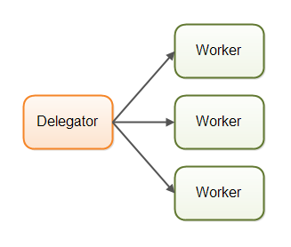
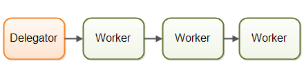

# **Паралелизм**
Параллелизм - общее понятие обозначающие паралельное выполнение задач.

#### **Различают два вида параллелизма:**
1. **Многопоточность** - параллелизм, в котором задачи выполняются одновременно на разных процессорах. 
2. **Многозадачность** - паралелизм, в котором задачи выполняются на одном процессоре одновременно,
    но процессор постоянно переключается между задачами.

В первую очередь речь будет идти о многопоточности в Java, но некоторые проблемы, возникающие при многопоточности,
аналогичны проблемам, возникающим при многозадачности и в распределенных системах.

#### **Основные преимущества многопоточности:**
1. Позволяет создвать многопользовательские системы.
2. Позволяет эффективно использовать ресурсов. Прежде всего ЦП. (Моменты ожидания и простоя системы)
3. Позволяет увеличить производительность системы. (За счет распаралеливания задач)
4. Более отзывчивые программы.
5. Например, в графических приложениях многопоточность может обеспечить плавное взаимодействие
с пользователем даже при выполнении тяжелых вычислений в фоновом режиме.
6. Более справедливое разделение ресурсов ЦП между различными задачами.
7. Масштабируемость.

#### **Многопоточность является сложной задачей.**
Потоки выполняются в рамках одной и той же программы и, следовательно, 
одновременно читают и записывают одну и ту же память. Это может привести к ошибкам.

    Если поток считывает ячейку памяти, а другой поток записывает в нее, какое значение
    в конечном итоге прочитает первый поток? Старое значение? Значение, записанное вторым потоком? Или значение,
    представляющее собой смесь этих двух значений? Или, если два потока одновременно записывают в одну и ту же ячейку
    памяти, какое значение останется после их завершения? Значение, записанное первым потоком? Значение, записанное
    вторым потоком? Или смесь двух записанных значений?

Сейчас используется паралелизм с отдельными состояниями в разных потоках. Появились новые асинхронные платформы
и наборы инструментов с «отдельным состоянием», такие как Netty, Vert.x и Play/Akka и Qbit. Были опубликованы новые
неблокирующие алгоритмы параллелизма, а в наши наборы инструментов добавлены новые неблокирующие инструменты,
такие как LMax Disruptor. Новый параллелизм функционального программирования был представлен
в платформе Fork and Join в Java 7 и API потоков сбора данных в Java 8.

#### **Затраты на многопоточность**
1. Сложная логика работы с потоками и общими данными.
2. Сложно отловимые ошибки.
3. Затраты процессорного времени на переключения между потоками.
4. Затраты оперативной памяти на отдельные потоки.

#### **Общее и отдельное состояния потоков:**
1. **Общее состояние** означает, что разные потоки в системе будут разделять некоторое состояние. 
Под состоянием подразумеваются некоторые данные, обычно один или несколько объектов или тому подобное. 
Когда потоки разделяют состояние, могут возникнуть такие проблемы, как состояния гонки, взаимоблокировки и т. д. 
Конечно, это зависит от того, как потоки используют и получают доступ к общим объектам.
2. **Раздельное состояние** означает, что различные потоки в системе не имеют общего состояния. 
Если различным потокам необходимо взаимодействовать, они делают это либо путем обмена неизменяемыми объектами
между собой, либо путем отправки между ними копий объектов (или данных). Таким образом, когда никакие два 
потока не пишут в один и тот же объект (данные/состояние), вы можете избежать большинства распространенных
проблем параллелизма.

### **Модель Parallel Workers (Параллельные рабочие процессы)**
\
Каждый работник выполняет полную задачу от начала до конца, работая параллельно с другими работниками.
####  **+ Работники независимы и задача легко маштабируется.**
####  **- Общие данные**
1. Сложности с синхронизацией доступа к общим данным для предотвращения состояний гонки и других проблем параллелизма.
2. Потеря распараллеливания из-за блокировок при доступе к общим структурам данных, что может привести к снижению
производительности из-за конкуренции.
3. Сложность в реализации эффективных неблокирующих алгоритмов, которые могли бы уменьшить конкуренцию
и увеличить производительность.
4. Использование постоянных структур данных как альтернативного подхода для обеспечения согласованного изменения
общих данных, однако это может привести к ухудшению производительности из-за особенностей доступа
к данным на современном оборудовании.
#### **- Отсутствие отдельного состояния**
#### **- Общее состояние**
1. Каждый из потоков может его изменить, и потому нужно переодически его перечитывать.
2. Не соблюдение порядка выполнения задач.

### **Модель Assembly Line (Конвейерная сборка)**
\
Каждый работник выполняет только часть полной работы. 
После завершения своей части работы работник передает работу следующему работнику.\
Такие системы обычно используют неблокирующий ввод-вывод (IO) что позволяет им не ждать завершения операций ввода-вывода. 
Вместо этого они передают управление следующему работнику после выполнения своей части задания.
Задания могут перемещаться между несколькими конвейерами или даже пересылаться нескольким работникам для параллельной обработки. 
Конвейеры могут быть сложными, включая различные виртуальные линии производства.
#### **Реактивные, управляемые событиями системы**
Такие системы, еще называют реактивными системами или системами, управляемыми событиями.
Работники системы реагируют на события, происходящие в системе, полученные из внешнего мира или излучаемые другими
работниками. Примерами событий могут быть входящий HTTP-запрос или завершение загрузки определенного файла в память...
#### **Популярные реактивные системы**
1. **Vert.x**
2. **Akka**
3. **Node.JS (JavaScript)**
#### **Виды конверных сборок**
- **Актеры** - Актеры могут отправлять сообщения напрямую друг другу. Сообщения отправляются и обрабатываются асинхронно. 
Актеры могут использоваться для реализации одной или нескольких сборочных линий обработки заданий, как описано ранее.
- **Каналы** - Работники не общаются друг с другом напрямую. Вместо этого они публикуют свои сообщения (события)
на разных каналах. Другие работники могут затем прослушивать сообщения по этим каналам, причем отправитель не знает,
кто их слушает. **_(Более гибкий вариант сборочной линии, нежели актеры)_**\
####  **+ Нет общего состояния**
#### **+ Есть отдельное состояние**
#### **+ Better Hardware Conformity (Лучшее соотвествие оборудования)**
1. Проще работать с множеством алгоритмов и решений.
2. Данные, можно кешировать в памяти процессора, ускоряя работу.
#### **+ Гарантия порядка работ - при необходимости**
1. Проще работать с такой системой.
2. Отказоустойчивость - логгирование этапов, с последующим востановлением состояния.
#### **- Сложность кода**
1. Выполнение кода распределено между множеством классов. Это очень усложняет задачу понимания, какой участок кода
выполняется сейчас.
2. Код как обработчики обратного вызова - которых становится все больше, и он превращается в не читаемые дебри,
что называют адом обратных вызовов.

### **Модель Functional Parallelism**
Модель конкурентности на основе вызовов функций,
где они действуют как "агенты" или "акторы", обменивающиеся сообщениями.
Аналогия с моделью сборочной линии. Каждый вызов функции выполняется независимо.

Параметры функций копируются, предотвращая гонки данных и делая выполнение функций аналогичным атомарным операциям.
Это позволяет каждому вызову функции выполняться независимо, включая параллельное выполнение на отдельных процессорах.

С Java 7 появился пакет java.util.concurrent с ForkAndJoinPool для функциональной параллелизации.
В Java 8 добавили параллельные потоки для обработки больших коллекций. Некоторые разработчики критикуют ForkAndJoinPool.

Функциональный параллелизм требует внимательного выбора вызовов функций для параллелизации из-за накладных расходов
на координацию. Маленькие функции могут быть медленнее при параллельном выполнении из-за этой координации. 
Реактивная модель также может достигать параллелизма, но с большим контролем над этим процессом. 
Если система уже занята выполнением других задач, попытка параллельного выполнения отдельной задачи может
быть неоптимальной из-за конкуренции за ресурсы.

https://jenkov.com/tutorials/java-concurrency/same-threading.html
https://jenkov.com/tutorials/java-concurrency/single-threaded-concurrency.html
https://jenkov.com/tutorials/java-concurrency/concurrency-vs-parallelism.html